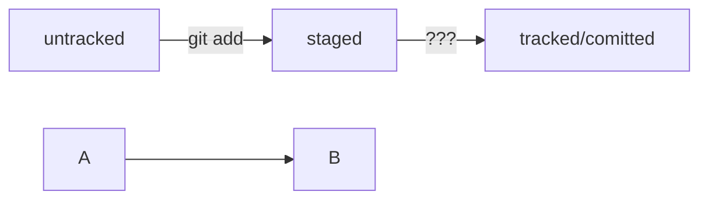

# Копируем репозитории: выполняем клонирование и «форк»  
На платформе GitHub хранится множество проектов. Часть из них находится в открытом доступе. Такие open source проекты можно скачать на свой компьютер, внести какие-то правки или просто разобраться, как всё устроено внутри.  
Процесс копирования удалённого репозитория на локальный компьютер называется клонированием. Клонирование репозитория — обычно первое, что делает разработчик на новом месте работы. Вы сымитируете эту ситуацию в уроке.  
## Клонировать репозиторий — git clone  
Откройте этот репозиторий. Нажмите на зелёную кнопку Code. Появится окно со ссылкой. Если вы уже настроили SSH-ключ, убедитесь что выбрана опция SSH и нажмите на кнопку с двумя квадратами справа — она скопирует ссылку в буфер обмена. Вы также можете скопировать ссылку вручную.  

 Если вы не настраивали SSH-ключ, рекомендуем ещё раз заглянуть в урок об SSH и настроить его. Так работа с GitHub будет более безопасной.
Теперь откройте консоль, перейдите в папку, в которую хотите положить репозиторий, и выполните команду git clone (от англ. clone — «клон», «копия»). Она создаст копию удалённого репозитория на вашем компьютере. В качестве параметра команде нужно передать адрес репозитория, который вы только что скопировали на GitHub.  
$ git clone https://github.com/yandex-praktikum/git-clone-lesson  
укажите адрес репозитория, который нужно склонировать 
Команда git clone автоматически связывает локальный и удалённый репозитории. То есть если в GitHub-репозитории что-то поменяется (например, добавятся коммиты), вам не нужно будет заново клонировать его. Достаточно будет выполнить команду, которая обновит вашу копию.  
Убедитесь в том, что репозитории связаны, командой git remote -v.  
$ cd git-clone-lesson  
$ git remote -v  
origin    git@github.com:yandex-praktikum/git-clone-lesson.git (fetch)  
origin    git@github.com:yandex-praktikum/git-clone-lesson.git (push)     
Готово! Теперь на вашем компьютере есть копия удалённого репозитория.  

Допустим, вы хотите усовершенствовать чужой проект или как-то использовать его в своей работе, но у вас нет прав на изменение оригинального репозитория. Разберём ещё одну полезную операцию копирования проектов. В отличие от клонирования, она не скачает репозиторий на локальный компьютер, но добавит его прямо в ваш аккаунт на сервере GitHub.  
## Что такое Fork  
Fork (англ. «развилка», «ответвление»), или «форк», — это GitHub-операция; напрямую с Git она не связана. «Форк» создаёт копию репозитория в аккаунте GitHub. Такая копия будет полностью независима. Изменения, которые вы внесёте, не будут синхронизированы с исходным репозиторием.  
В процессе «форка» создаётся копия всех файлов, истории коммитов и веток. Эта копия сохраняется в вашей учётной записи GitHub.  
Вот некоторые из распространённых причин использования «форков»:  
Вы хотите внести свой вклад в проект (например, open source), но не имеете прав на изменение исходного репозитория. Тогда вы можете сделать «форк», добавить нужные правки, а затем отправить запрос на включение этих изменений в оригинальный проект.  
Вы хотите развивать проект независимо от исходного. Допустим, создатели проекта решили, что не будут добавлять функциональность, которая вам необходима. В таком случае вы можете сделать «форк» и добавить её самостоятельно.  
## Применяем «форк»  
1. Потренируйтесь выполнять «форк». Перейдите по этой ссылке и нажмите на кнопку Fork в правом верхнем углу.  

2. В открывшемся окне вы можете поменять название и описание репозитория. Или поставить галку, чтобы склонировать только главную ветку вместо всех сразу. Нажмите Create fork (англ. «создать копию репозитория»).  

3. Немного подождите, пока репозиторий скопируется. После этого он будет доступен по адресу https://github.com/%USERNAME%/git-basics, где %USERNAME% — ваше имя пользователя.
В результате вы получите полную копию исходного репозитория, которую можно свободно изменять и которой можно управлять.   

